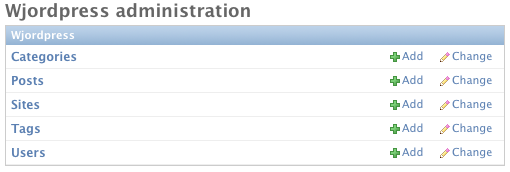

Wjordpress
==========

Wjordpress is a reusable app for Django_ that allows you to use WordPress_ as
your editing interface and Django_ for your presentation.

With Wjordpress, you can interact with WordPress content as if it had been
entered in the Django admin. Wjordpress does not pretend to be WordPress and
does not provide any presentation. After the initial link, it's a "Fire-and-
forget" system. The Wjordpress Django admin interface is not something you'll
have to mess with on a daily basis. Changes made in WordPress will
automatically

.. _Django: https://www.djangoproject.com/
.. _WordPress: http://wordpress.org/


WordPress Setup
---------------

Once you have a WordPress site setup, you need to make sure it has the `JSON
REST API`_ plugin installed and activated. That's it! If you want real-time
updates, you'll need the HookPress_ plugin.

.. _JSON REST API: http://wordpress.org/plugins/json-rest-api/
.. _HookPress: http://wordpress.org/plugins/hookpress/


Django Setup
------------

**Install into your environment**::

    # for the latest "stable"
    pip install wjordpress

    # if live dangerously
    pip install https://github.com/texastribune/wjordpress/archive/master.tar.gz

**Install into your Django project**::

    INSTALLED_APPS = [
        # ... your other installed apps
        'wjordpress',
    ]

**Create the database tables**::

    # python manage.py migrate wjordpress  # TODO
    python manage.py syncdb

**Add a WordPress site**:

In your Django admin, add a new site in ``Wjordpress -> Sites``:



Just enter the url to the WordPress blog and save.


WordPress HookPress Setup
`````````````````````````

Setting this up will trigger updates in real-time as you edit content in
WordPress.

1. Install the plugin
2. add a ``save_post`` hook to the hook url the Django admin shows for the
   site.
3. Make sure the ``ID`` field is sent.

You can also do manual syncs with ``manage.py wjordpress_fetch``.


Scenarios
---------

**Easy peasy lemon squeezy**:

1. Setup a link to a WordPress site
2. Write views_ and templates_ to display WordPress content

This is how the `reference project`_ syncs with `my blog`_

.. _views: https://github.com/texastribune/wjordpress/blob/master/example_project/viewer/views.py
.. _templates: https://github.com/texastribune/wjordpress/tree/master/example_project/templates
.. _reference project: http://wjordpress.herokuapp.com/
.. _my blog: http://www.crccheck.com/blog/

**Bring your own models**:

1. Setup a link to a WordPress site
2. Create a ``post_save`` signal on the Wjordpress models to sync to your own
   content models
3. Write a view and template to display your content models


----

How to pronounce "Wjordpress": http://youtu.be/tmyGrk99uzM
