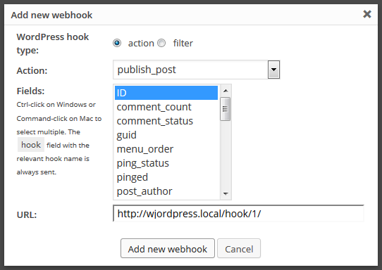
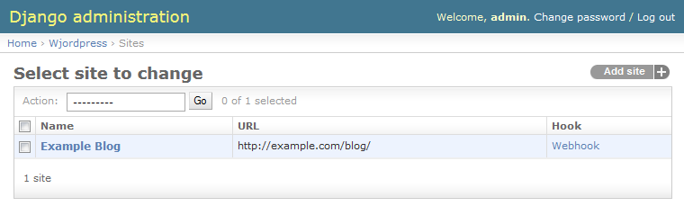

Webhooks
========

To automatically keep Django and WordPress in sync, you should install the
HookPress_ plugin.

Saving will now be slower in WordPress because there are additional synchronous
requests to the webhook on every save. Later, in a separate thread, Django asks
WordPress about details of post. When you save a post, two webhook calls are
made. One for the updated post, and one for the new revision.

.. _HookPress: http://wordpress.org/plugins/hookpress/

Installing HookPress
--------------------

It's just like installing any other WordPress plugin. Starting from your admin
dashboard, you go to "Plugins", then "Add New", search for "hookpress", and
then install.

Configuring HookPress
---------------------

Starting again from the admin dashboard, go to "Settings", then "Webhooks",
then "Add webhook". At the least, you should set up a ``publish_post`` hook
that sends the `ID` field back like this:

To get the url, go to the Wjordpress section of the Django admin and copy the
"Webhook" url:

